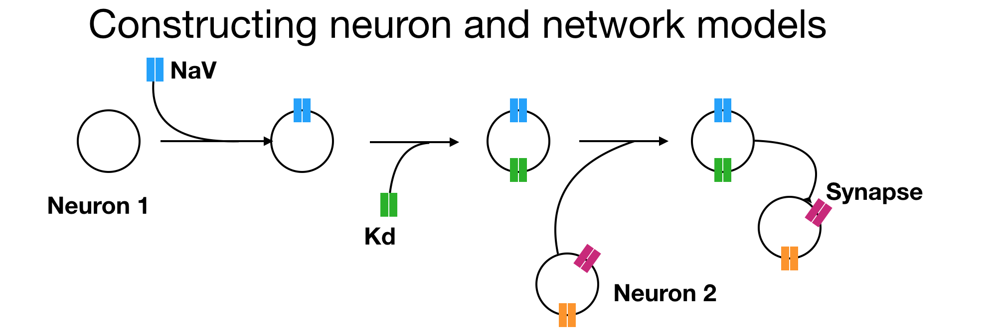

In this page we will learn how to construct neuron and network models in `xolotl` from scratch. The first step to constructing any model in `xolotl` is to create a container for everything we create in it. In this section (and everywhere else), we will use the variable `x` to hold the `xolotl` object.

```matlab
% create a xolotl object
x = xolotl;
```

`xolotl` is a *component-oriented* simulation environment, which means that all "things" that can exist in the model are pre-defined components; and models are created by linking this components together like building blocks.

`xolotl` has 4 fundamental types of components:

1. `compartment` Objects of this type are used to represent compartments. Compartments can model entire neurons or parts of neurons. Compartments contain all other component types.
2. `conductance` Objects of this type represent populations of ion channels. They are contained within compartments.
3. `synapse` Objects of this type represent populations of synapses. They connect two different compartments together.
4. `mechanism` Objects of this type can represent any arbitrary (typically intracellular) mechanism. For example, Calcium buffering is represented as a mechanism.

## Create a compartment


The first thing we want to do is create a compartment. A compartment is a piece of neural tissue that shares a common voltage. A compartment can represent a whole neuron, or a small part of one.

To create a compartment, and add it to our xolotl object, we use:

```matlab
x.add('compartment','AB','A',0.0628)
```

What we're doing here is creating a compartment and adding it to our `xolotl` object. This neuron is called `AB`, and we are specifying that it has a surface area of 0.0628 $mm^2$.

We get a prompt that looks like this:

```matlab
xolotl object with
---------------------
+ AB  
---------------------
```

This tells us that our xolotl object has one compartment, and its name is `AB`.

To inspect your `xolotl` object at any time, simply type its name. Here, since we used a variable called `x`, we type

```matlab
x
```

## Add channels to a compartment

OK, let's now add a set of channels to our compartment.

```matlab
x.AB.add('prinz/NaV','gbar',1000);
x.AB.add('prinz/CaT','gbar',25);
x.AB.add('prinz/CaS','gbar',60);
x.AB.add('prinz/ACurrent','gbar',500);
x.AB.add('prinz/KCa','gbar',50);
x.AB.add('prinz/Kd','gbar',1000);
x.AB.add('prinz/HCurrent','gbar',.1);
```

Note that, in each line, we are:

1. creating a conductance object by specifying the path to the C++ file
2. adding it to the compartment "AB"
3. Configuring the `gbar` parameter in that conductance

The first argument is a character vector that represents a unique path to the C++
header file. For example, if your conductance is specified in

```matlab
'~/code/xolotl/c++/conductances/prinz/NaV.hpp'
```

but there are other `'prinz'` and `'NaV'` conductances, then the character vector
`'prinz/NaV'` suitably indicates which conductance you mean.

Now, if we look at our model, we see:

```matlab
x

>xolotl object with
---------------------
+ AB  
  > ACurrent (g=500, E=-80)
  > CaS (g=60, E=30)
  > CaT (g=25, E=30)
  > HCurrent (g=0.1, E=-20)
  > KCa (g=50, E=-80)
  > Kd (g=1000, E=-80)
  > NaV (g=1000, E=50)
---------------------

```


## Add a mechanism

So far, the model consists of a compartment and some channels. There is no mechanism for modeling the influx of Calcium, and its buffering. Let's add a Calcium mechanism:

```matlab
x.AB.add('prinz/CalciumMech');

```

If we integrate and plot the model now, using

```matlab
x.plot()
```

we should see something like this:


## Wire up compartments using synapses

Let's create another compartment, and connect the two compartments using a synapse

```matlab
x.add('compartment','LP','A',0.0628)
x.LP.add('prinz/NaV','gbar',1000);
x.LP.add('prinz/Kd','gbar',1000);
```

Now we can connect the two compartments using a synapse:


```matlab
x.connect('AB','LP','AlphaSynapse')
```

## Discover parameters and structure of the model

We've just added a new synapse. Let's explore it to understand where it is and what parameters it has. If we look inside the LP compartment, we see:

```matlab
x.LP
ans =
 compartment object (9f24f53) with:

              vol : NaN
                V : -69.0463206551712
              len : NaN
           radius : NaN
               Ca : 0.05
           Ca_out : 3000
       Ca_average : 0.0500000000000942
        Ca_target : NaN
               Cm : 10
         tree_idx : NaN
                A : 0.0628
       neuron_idx : NaN
  shell_thickness : NaN
               Kd : Kd object
              NaV : NaV object
   AlphaSynapseAB : AlphaSynapse object
```

We see that the AlphaSynapse is included inside the LP neuron. By drilling down into the synapse, we can look at its properties:

```matlab
x.LP.AlphaSynapseAB
ans =
 AlphaSynapse object (5f2921a) with:

          gmax : 0
      V_thresh : 10
             s : 0
             E : 0
         tau_s : 10

```

We see that its `gmax` value, or strength in `nS` is 0.


## Specify initial conditions

Let's set a larger value for the synapse strength. Changing any parameter of the model is as simple as using dot notation:

```matlab
x.LP.AlphaSynapseAB.gmax = 20;

```

## Integrate

We can now integrate and plot the model, and we should see something like this:


## See Also

* [xolotl.add](https://xolotl.readthedocs.io/en/master/reference/xolotl-methods/#add)
* [cpplab.add](https://xolotl.readthedocs.io/en/master/reference/cpplab-methods/#add)
* [xolotl.connnect](https://xolotl.readthedocs.io/en/master/reference/xolotl-methods/#connect)

