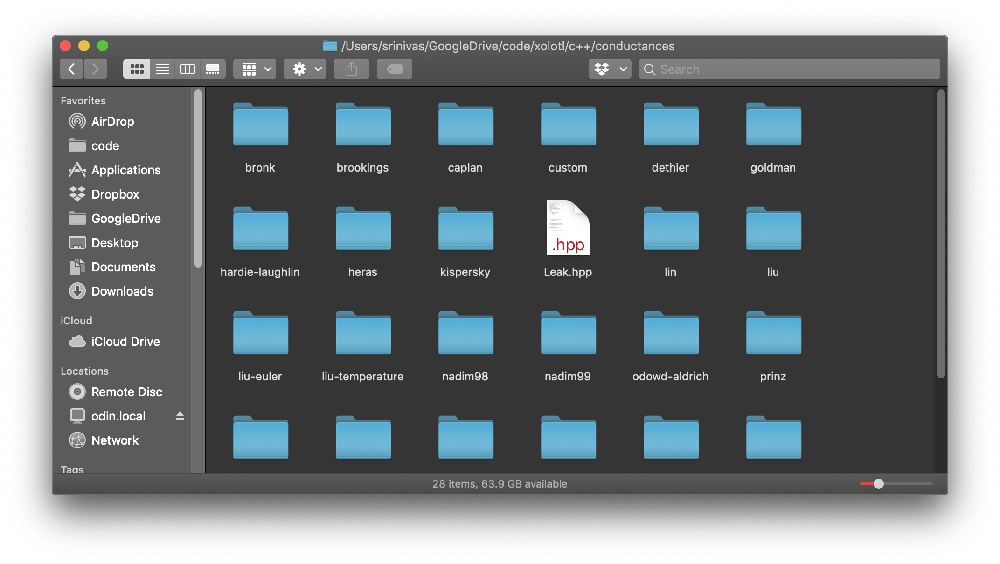

In this document we will learn how to discover existing components in `xolotl`.


### Using [`xolotl.search()`](https://xolotl.readthedocs.io/en/master/reference/matlab/cpplab/#search)

`xolotl` can search for all C++ header files using wildcards. For example, to find all components that are sourced from papers authored by Astrid Prinz (this means it will look for .hpp files in any folder called "prinz"), we can use:

```matlab
xolotl.search('prinz')

------------------------------------------------------------------------------------
 Name                   Parent Class        Object Information
------------------------------------------------------------------------------------
 ACurrent               conductance         A Current (K+)                                    
 CaS                    conductance         Slow Calcium current                              
 CaT                    conductance         Transient calcium current                         
 HCurrent               conductance         Hyper-polarization activated inward current       
 KCa                    conductance         Calcium activated Potassium current               
 Kd                     conductance         Inward rectifying potassium current               
 NaV                    conductance         Sodium conductance                                
 ACurrent               conductance         temperature-sensitive A current (K+)              
 CaS                    conductance         temperature-sensitive slow Calcium current        
 CaT                    conductance         temperature-sensitive transient calcium           
 HCurrent               conductance         temperature-sensitive H Current                   
 KCa                    conductance         temperature-sensitive slow Calcium                
 Kd                     conductance         temperature-sensitive inward Potassium            
 NaV                    conductance         temperature-sensitive Sodium                      
 CalciumMech            mechanism           Calcium buffering and influx mechanism            
 Cholinergic            synapse             Graded Cholinergic synapse                        
 Glutamatergic          synapse             Graded Glutamatergic synapse                      
 Cholinergic            synapse             temperature-sensitive graded Cholinergic synapse  
 Glutamatergic          synapse             temperature-sensitive graded Glutamatergic synapse
------------------------------------------------------------------------------------
```


### Hands-on exploration

Every component in `xolotl` is linked to a separate `C++` header file with a `*.hpp` extention. These files are organized in the `C++` folder in your `xolotl` folder. To know where this folder is, copy and paste this in your MATLAB terminal:

```matlab
[fileparts(fileparts(which('xolotl'))) filesep 'c++']
```

In this folder, you will find components [organized by type and then by first author](construct-models.md#whereshouldIputthem). For example, this is what the "conductances" folder looks like:



Knowing what components are available is as simple as looking for yourself in this folder! `xolotl` was explicitly designed to make it easy to know *where* the C++ code your model was running was physically located on your computer, so that you can change it if you so choose.


For example, the delayed rectifier potassium conductance published in Liu *et al.* 1998 can be found in `../xolotl/c++/conductances/liu/Kd.hpp`.


## See Also


* [cpplab.search](https://xolotl.readthedocs.io/en/master/reference/matlab/cpplab/#search)

