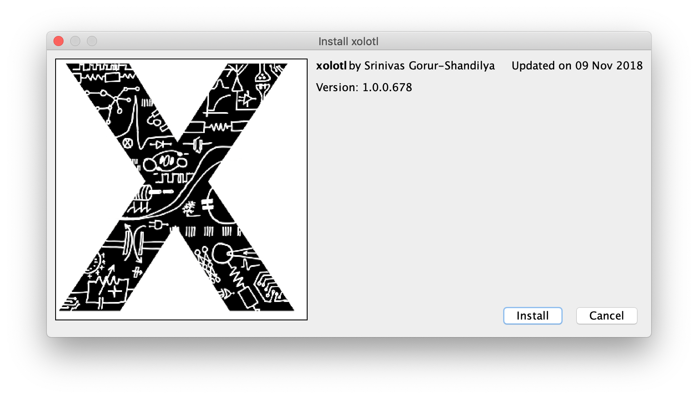

Here, we will learn how to install and configure `xolotl`. There are two ways to install `xolotl`, based on your level of expertise:

| Method | Download a MATLAB toolbox | Use git | 
| ---------- | --------------- | ---------- |
| Who should do this | Everyone |  Developers, advanced users |
| Ease | Very easy | Some configuration needed | 
| OS support | All common OSes | Probably won't work on Windows| 


## Installing

### Using a MATLAB toolbox

`xolotl` is available as a MATLAB toolbox. Click [here](https://github.com/sg-s/xolotl/releases/download/latest/xolotl.mltbx) to download it, and drag the downloaded file onto your MATLAB terminal to install it. You should get a popup that looks like this: 




Click on the "Install" button and you should be all set! 

### Using `git`


If you are comfortable with `git`, you can clone all the code and dependencies yourself:

```bash
git clone https://github.com/sg-s/srinivas.gs_mtools
git clone https://github.com/sg-s/puppeteer
git clone https://github.com/sg-s/xolotl
git clone https://github.com/sg-s/cpplab
```

You will have to manually set your `MATLAB` paths. Make sure you add the main folder for `puppeteer`, `cpplab`, and `xolotl`, and all subfolders of `srinivas.gs_mtools/src`.


## Updating 

In most cases, `xolotl` can update itself to the latest version using

```matlab
xolotl.update()
```

If you installed using `git`, `xolotl` will attempt to do a `git pull` and update itself. If you installed it as a MATLAB toolbox, `xolotl` will delete the old toolbox, download the new one, and install that. 


## Uninstalling

If you installed `xolotl` as a MATLAB toolbox, you can easily uninstall it using:

```matlab
xolotl.uninstall()
```

Note that this doesn't do anything if you installed using `git`, or if you manually downloaded the files and linked them. 

## Compilers on GNU/Linux

There are a couple of quirks specific to using the `MEX` compiler on Linux machines.

* `MATLAB` can be particular about the version of `g++` it works with. For best results, use the compiler version recommended by `MATLAB`. 
* In addition, it's best to point `MATLAB` towards the system compiler, rather than one installed through distributions like `Anaconda`. 
* On certain Linux distributions, `MEX` cannot identify the installed `g++` compiler, even when it exists on your path (e.g. `which g++` in the terminal works fine). The error looks something like this

```matlab
  >> !which g++
  /bin/g++
  >> !g++ -dumpversion
  8.1.0
  >> mex -setup C++
  Error using mex
  No supported compiler was found.
```
 
 `MATLAB` recommends changing your path so that you default to an older version of `g++`. This is not strictly necessary. `MATLAB` can still compile using `MEX` with newer versions of `g++` in most cases. Generally, downgrading to an older version of `g++` doesn't solve this problem. 

There is a relatively simply fix however. Credit goes to GitHub user [bonanza123](https://gist.github.com/bonanza123/) for figuring it out.

* First, download the proper version of `gcc/g++` as normal. If you use a package manager, there are generally legacy versions under `gcc-VERSION` where `VERSION` is the version number (e.g. 6). You can also find them [here](https://gcc.gnu.org/). 
* Second, change the `mex_LANG_glnxa64.xml` specification file, where `LANG` is either `C` or `C++`. This is typically found at `~/.matlab/R2018a/mex_C_glnxa64.xml` (where `R2018a` is the `MATLAB` version and we're looking for the `C` language file). 
* Replace all references to `$GCC` with the path to the soft-link to your `gcc` compiler (e.g. `/usr/bin/gcc-6`). If you don't have a soft-link to your compiler set up (i.e. `which gcc` doesn't tell you the path to the link), then you have to [set one up](https://askubuntu.com/questions/898578/how-can-i-change-which-gcc-directory). 
* Repeat this process for the `mex_C++_glnxa64.xml` file. It should be in the same location as the `C`-specific file. Sometimes `MATLAB` doesn't generate the `C++` `.xml` file, causing a lot of errors. If it doesn't exist, copy the `C`-specific version of the file, rename it to `mex_C++_glnxa64.xml` and replace all references to `gcc` with `g++` so that `MATLAB` is forced to use the correct compiler.

The problem is fixed if you see something like this in `MATLAB`:

```matlab
  >> mex.getCompilerConfigurations('C++')
  ans =

  CompilerConfiguration with properties:

             Name: 'g++'
     Manufacturer: 'GNU'
         Language: 'C++'
          Version: ''
         Location: '/usr/bin/g++-6'
        ShortName: 'g++'
         Priority: 'A'
          Details: [1×1 mex.CompilerConfigurationDetails]
       LinkerName: ''
    LinkerVersion: ''
           MexOpt: '/home/alec/.matlab/R2018a/mex_C++_glnxa64.xml'
```


## See Also

* [xolotl.install](https://xolotl.readthedocs.io/en/master/reference/xolotl-methods/#install)
* [xolotl.uninstall](https://xolotl.readthedocs.io/en/master/reference/xolotl-methods/#uninstall)
* [xolotl.update](https://xolotl.readthedocs.io/en/master/reference/xolotl-methods/#update)
