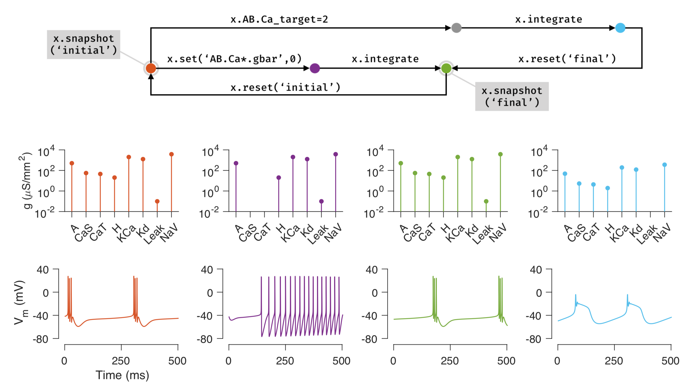

In this document we will learn how to use the `snapshot` and `reset` methods in xolotl to quickly bookmark parameters and use them to help us explore models.



## Saving snapshots
To quickly save and revert back to a certain set of numerical parameters in a model, you can use the `snapshot` and `reset` methods.

```matlab
% save a model's parameters as 'initial'
x.snapshot('initial')
% do something else to the model
x.I_ext = 0.2;
V = x.integrate;
% save this as a different state to return to later
x.snapshot('added_current');
% return to the previously saved 'initial' state
x.reset('initial');
```
## See Also


* [xolotl.snapshot](https://xolotl.readthedocs.io/en/master/reference/xolotl-methods/#snapshot)
* [xolotl.reset](https://xolotl.readthedocs.io/en/master/reference/xolotl-methods/#reset)
