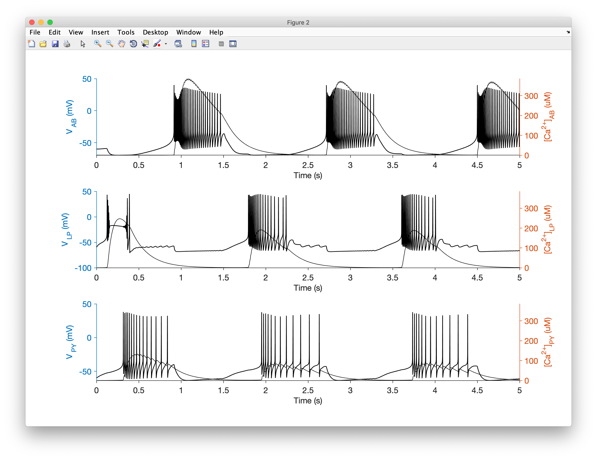

In this tutorial, we will walk through the process of creating a network model of three neurons connected together by synapses. We will integrate the model to find the membrane potential over time and view the output.

Code equivalent to this tutorial can be found in `../xolotl/examples/demo_stg.m`.

### A high-level view of the network

We will make a model of the pyloric network in the [stomatogastric ganglion in crustaceans](http://www.scholarpedia.org/article/Stomatogastric_ganglion). In our model of this network, there will be three cells called AB/PD, LP and PY, and they will be interconnected using two different types of inhibitory synapses: Cholinergic and Glutamatergic.

This is what it looks like:


First, we create a new xolotl object:

```matlab
x = xolotl;
```

### Making three compartments

In the last tutorial, we learnt how to create a compartment. Now, we make three of them, since we will need three model neurons:

```matlab
% create three compartments named AB, LP, and PY
x.add('compartment', 'AB');
x.add('compartment', 'LP');
x.add('compartment', 'PY');
```

If you inspect the xolotl object in the command window, you should see something like this:

```matlab
>> x

xolotl object with
---------------------
+ AB  
---------------------
+ LP  
---------------------
+ PY  
---------------------
```

We have now constructed our three compartments (with nothing in them).

### Adding conductances

Each compartment in our model will have eight conductances:

* `NaV`, a fast, inactivating sodium conductance;
* `CaT`, a transient calcium conductance;
* `CaS`, a slow calcium conductance;
* `ACurrent`, an A-type potassium conductance;
* `KCa`, a calcium-gated potassium conductance;
* `Kd`, a delayed rectifier potassium conductance;
* `HCurrent`, a hyperpolarization-activated rectifying conductance; and
* `Leak`, the passive leak current.

In xolotl, these conductances exist within the `../c++/conductances/prinz/` folder. We can add them each one by on, or we can get fancy and write a small script to add them. Let's do that, since this approach can scale well.

The conductances we want are:

```matlab
conds = {'prinz/NaV', 'prinz/CaT', 'prinz/CaS', ...
        'prinz/ACurrent', 'prinz/KCa', 'prinz/Kd', ...
         'prinz/HCurrent', 'Leak'};
```

We're going to use some parameter values defined in [this paper](https://www.nature.com/articles/nn1352). The maximal conductances of these channels (in $\mathrm{\mu S / mm^2}$) are:

```matlab
% AB/PD
gbars(:, 1) = [1000, 25, 60, 500, 50, 1000, 0.1,   0];

% LP
gbars(:, 2) = [1000,  0, 40, 200,  0,  250, 0.5, 0.3];

% PY
gbars(:, 3) = [1000, 24, 20, 500,  0, 1250, 0.5, 0.1];
```

Now we can add all the conductances to the compartments and configure them with the correct maximal conductances in one go:

```matlab
comps		= x.find('compartment');
for i = 1:length(comps)
	for j = 1:length(conds)
		x.(comps{i}).add(conds{j}, 'gbar', gbars(j, i));
	end
end
```

The xolotl object should look like this:

```matlab
>> x

xolotl object with
---------------------
+ AB  
  > ACurrent (g=500, E=-80)
  > CaS (g=60, E=30)
  > CaT (g=25, E=30)
  > HCurrent (g=0.1, E=-20)
  > KCa (g=50, E=-80)
  > Kd (g=1000, E=-80)
  > Leak (g=0, E=-50)
  > NaV (g=1000, E=50)
---------------------
+ LP  
  > ACurrent (g=200, E=-80)
  > CaS (g=40, E=30)
  > CaT (g=0, E=30)
  > HCurrent (g=0.5, E=-20)
  > KCa (g=0, E=-80)
  > Kd (g=250, E=-80)
  > Leak (g=0.3, E=-50)
  > NaV (g=1000, E=50)
---------------------
+ PY  
  > ACurrent (g=500, E=-80)
  > CaS (g=20, E=30)
  > CaT (g=24, E=30)
  > HCurrent (g=0.5, E=-20)
  > KCa (g=0, E=-80)
  > Kd (g=1250, E=-80)
  > Leak (g=0.1, E=-50)
  > NaV (g=1000, E=50)
---------------------
```

Notice that we didn't specify what the reversal potentials should be, but they were automatically configured. That's because they have defined default values.

Let's change the `Leak` reversal potential a little bit:

```matlab
x.AB.Leak.E = -55; % mV
x.LP.Leak.E = -55; % mV
x.PY.Leak.E = -55; % mV
```

At this point, we have created three neurons, and inserted channels into them.

### Adding calcium dynamics

What we haven't considered so far is the dynamics of calcium. Some channels (like `CaT` and `CaS`) change the intracellular calcium concentration (by allowing calcium in), and others (like `KCa`) change their activity based on the intracellular calcium concentration. Therefore, we need a calcium mechanism for each compartment.

Let's add one to each compartment.

```matlab
for i = 1:length(comps)
	x.(comps{i}).add('prinz/CalciumMech');
end
```

### Adding synapses

Synapses connect our compartments together. In the stomatogastric circuit, there are two inhibitory synapse types, one that is glutamatergic, and one that is cholinergic. We can use the `connect` function to create synapses and wire up cells. For example,

```matlab
x.connect('AB', 'LP', 'prinz/Cholinergic', 'gmax', 30);
```
creates a cholinergic synapse from `AB` to `LP` with a specified maximal conductance of $30~\mathrm{\mu S}$.

Let's add the rest of the synapses:

```matlab
x.connect('AB','PY','prinz/Chol','gmax',3);
x.connect('AB','LP','prinz/Glut','gmax',30);
x.connect('AB','PY','prinz/Glut','gmax',10);
x.connect('LP','PY','prinz/Glut','gmax',1);
x.connect('PY','LP','prinz/Glut','gmax',30);
x.connect('LP','AB','prinz/Glut','gmax',30);
```

Note that we didn't have to type out the full path to the synapse `.hpp` file to
create the synapse. You can use any part of a network component header file path so
long as it uniquely specifies the network component.

Synapses are added to the post-synaptic compartment as `synapse` objects.

### Simulating the model

Let's simulate the model for 5 seconds.

```matlab
x.t_end = 5000; % milliseconds
```

Let's integrate the model and plot the voltage trace and the calcium concentration:

```matlab
x.plot
```

You should see something like this:



!!! Note "A shortcut through this tutorial"
    You can reproduce the model we created here by running the `demo_pyloric_net` script. Make sure you run `xolotl.go_to_examples` first so that you're in the right folder.
