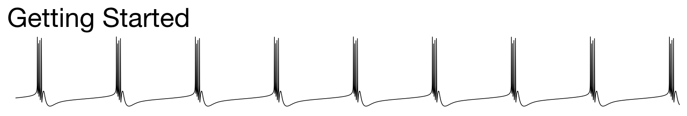

In this tutorial we will walk through the steps required to install `xolotl`
and make sure everything works well. You will need:

1. [MATLAB](https://www.mathworks.com/products/matlab.html) 	(`xolotl` will not work on GNU Octave)
2. An internet connection

## Installing xolotl

Download [xolotl here](https://github.com/sg-s/xolotl/releases/download/latest/xolotl.mltbx) and drag the downloaded file (`xolotl.mltbx`) onto your MATLAB workspace. MATLAB should automatically open a prompt asking you if you want to install it.

!!! note
    There are other ways to install xolotl. For example, you can download via git. [Instructions here](https://xolotl.readthedocs.io/en/master/how-to/install-configure/#using-git)


Then we need to install a C/C++ compiler, and get MATLAB to work with that. Follow these instructions based on your operating system:

## Installing a compiler

### macOS

1. Install [XCode](https://developer.apple.com/xcode/)
2. Open XCode, and accept the license agreement.


### Windows

1. Download and install the [MinGW compiler](https://www.mathworks.com/matlabcentral/fileexchange/52848-matlab-support-for-mingw-w64-c-c-compiler) from the Mathworks FileExchange. You'll need to log in using a Mathworks account. This ridiculous restriction is Mathworks' fault.

!!! note
    You can also get the compiler as a MATLAB "add-on."


### GNU/Linux

1. Use your favorite package manager to install a C and C++ compiler. For example, on Debian-based systems, use `sudo apt install gcc & sudo apt install g++`
2. Verify that your compiler is on the MATLAB path by running `system('which gcc')` from within MATLAB

## Configuration

### Configure MATLAB to use compilers

Run this in your MATLAB terminal:

```matlab
mex -setup c++
mex -setup c
```

You should see something like this:

```matlab
% This is what you'll see on macOS. The precise message
% may be different on other operating systems
MEX configured to use 'Xcode Clang++' for C++ language compilation.
MEX configured to use 'Xcode with Clang' for C language compilation.
```

!!! note
    Setting up a compiler for MATLAB can be tricky. See our more detailed advice [here](https://xolotl.readthedocs.io/en/master/how-to/install-configure/#compilers-on-gnulinux).

### Verify your installation

OK, let's make sure everything works. Copy and paste the following code into your MATLAB terminal:

```matlab
xolotl.go_to_examples
demo_bursting_neuron
```

You should see this plot appear:


!!! note
    If you don't see this plot, or see some horrible error message, click on [this link](../troubleshooting.md) so we can figure out what went wrong
